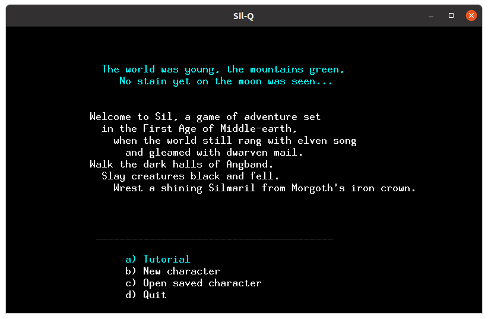
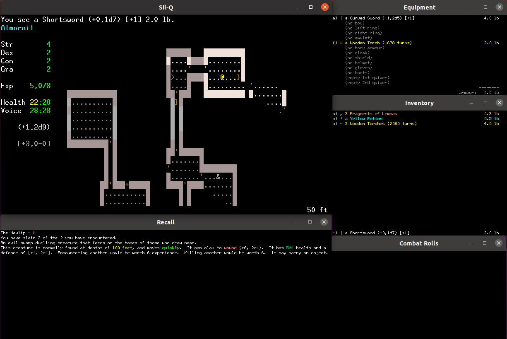
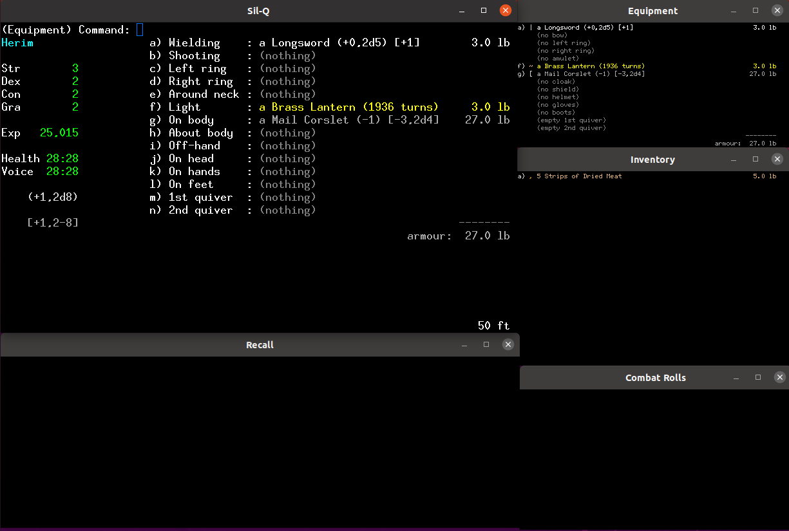

# How to Mod Roguelikes: Creating Your Own Variant of Sil-Q

Have you ever wanted to modify a game? What about make your own game?

Modifying an existing game is the easiest way there is to make a game.
It's a fantastic exercise in both _gameplay design_ and _game programming_.
You avoid the "blank page" problem, because it's so easy to find a "what if"
question about an existing game, or an "I'd like it even more if" statement.
Also, all
the boring things like menus and savegames have already been implemented,
so you can focus on actual gameplay changes.

Many **roguelike games** are free and open source software (FOSS), available
under various licenses. This means that we are legally free to modify
the game and distribute our own variants of it - as long as we follow
the terms of the particular license provided with that game.

### What this is

This article is a walkthrough for creating your own variant of
an open-source roguelike game. We will be using **_Sil-Q_** as an example -
but the general process is the same for many other games, such as _Brogue_
and _Angband_.

Roguelike fans often refer to variants of a game as "forks", from the
version control practice of creating parallel versions of a project.

Many of the popular roguelikes of today - _DCSS_, _NetHack_,
_Angband_, _Brogue CE_ - are forks of earlier games. In fact,
 _Sil-Q_ - the game we will be modifying today - is itself a fork of
_Sil_, which is a heavily modified variant of _NPPAngband_, which
is a fork of _Angband_.


### What this isn't

This guide will follow each step
on the way towards having your own roguelike fork to play. Along the way,
I will point out some potential pitfalls, and explain my thought process
when diving into an unfamiliar codebase.

However, this article will not teach you to program in general.

This article will not
teach you what `git` is or how to use it.
Some tools will be recommended,
but you will have to find and install those tools yourself.

If you're not familiar with Sil, an introduction will not be
provided here, but you can read
[the Sil manual](https://github.com/sil-quirk/sil-q/blob/master/Sil%201.3%20Manual.pdf)
to learn more.

Also note that this guide is not legal advice - always consult the specific
license of the software you're modifying.


## Learning by doing: Create your own mod of _Sil-Q_

Prerequisite knowledge: basic knowledge of git and Linux.

Knowledge of the C programming language will not be necessary for
the changes we make in this tutorial,
but it will be useful afterwards if you want to make
larger changes to the game logic.


### 1. Set up your operating system

As a general guideline, for any open-source C projects, roguelike or
otherwise, I recommend you get a **Linux** environment.

If you don't have a Linux installation ready, you can quite easily boot it off a USB stick.
Alternatively, you can run Linux in a virtual machine using a tool such as **VirtualBox VM**.
It doesn't really matter which way you run it, as long as you are able to run GCC to compile C projects.

For small bouts of C development, I use VirtualBox on Windows, with a Ubuntu 20.04 image, since that was the first OS image I found.
Other Linux distributions are available.
[VirtualBox](https://www.virtualbox.org/) is free and open-source, available
for all platforms, and costs nothing.
Setup instructions can be found on the web.
If you've never used a Linux before, then the Ubuntu variant is an easy introduction,
and there are plenty of guides for installing it available.

If your computer runs on **MacOS**/OS X, that will most likely work fine, being
 a Unix system. I haven't tried setting up a Mac for C development myself,
 so I can't comment more than that.

If you want to try to follow this guide on **Windows**, then _technically_,
you _could_ mess around with **Cygwin** to get C to compile.
I don't recommend trying that option, though.
It's simply not worth the pain, in my experience. However, the
[Sil-Q readme](https://github.com/sil-quirk/sil-q#windows-with-cygwin---tested-with-sil-q)
does say that it has been tested and confirmed to work. So it's up to you.


### 2. Set up your tools

If you installed Linux, then you will most likely already have `git`.
If not, install it now.

Later, you will likely need some build tools (e.g. `gcc`, `make`), but these
may have been packaged with your OS installation as well. If not, they can be
downloaded later when the need arises. Dependencies can typically be installed
with a package manager such as `apt-get` (Ubuntu) or `brew` (MacOS).
If you need to install dependencies using Cygwin, well, you're on your own.

You will also need a text editor or IDE for editing files
Any simple text editor will
do for the basic changes we will make in this tutorial. Later, though,
if you make bigger changaes to code, you may want a proper IDE.
Use whatever you prefer.


### 3. Clone or fork the repository

Now we need to acquire the source code.

The source code for Sil-Q (and most open-source roguelikes) is hosted
on GitHub, so our main options are to either clone the project, or to fork it.

https://github.com/sil-quirk/sil-q

**Cloning** works without a GitHub account, and is sufficient for looking at the code
and playing around with it for your own entertainment.
All you need is the git command line tool.
To clone the Sil-Q source code, execute this command:

```sh
git clone https://github.com/sil-quirk/sil-q.git
```

However, if you want to release a modified game to anyone else, you have to always release the source code (I am not a lawyer and this is not legal advice - always consult the specific license of the software you're modifying. Sil-Q's license can be read in [LICENSE.md](https://github.com/sil-quirk/sil-q/blob/master/LICENSE.md)).

For these purposes, **forking** the project is a better
option than cloning it, but will require you to have a GitHub account.

When logged in to GitHub, navigate to
 [the Sil-Q repository](https://github.com/sil-quirk/sil-q),
 then click ”Fork” on the top right. After a few seconds, you should have
 your personal repository, with a name like _Your_Profile/sil-q_.

Now, clone the forked repository to your machine:

```sh
git clone https://github.com/Your_Profile/sil-q.git
```

### 4. Compile the unmodified game


Now that you have a local copy of the source code, follow the
instructions provided in the repository to compile it .

1. Find the _makefile_, which defines the compilation of the executables.
For Sil-Q, it's at `src/Makefile.std.` Open this file in a text editor and
read the instructions within. The `README.md` suggests to uncomment one of the
variations, but the makefile also seems to contains a standard build option,
so we'll try that first.
Navigate to the `src` folder, then run the make command as advised in `README.md`:

  ```sh
  cd src
  make -f Makefile.std install
  ```

2. The `make` program should now run and begin building the project.
However, it runs into an error:

  ```output
  gcc -Wall -O1 -pipe -g -D"USE_X11" -D"USE_GCU"   -c -o main-gcu.o main-gcu.c
  main-gcu.c:64:10: fatal error: curses.h: No such file or directory
     64 | #include <curses.h>
        |          ^~~~~~~~~~
  compilation terminated.
  make: *** [<builtin>: main-gcu.o] Error 1
  ```

  (If you see other errors about missing tools, such as `gcc`
  or `make`, you may need to install them now, before proceeding to the next step.)

3. The error seems to suggest that we are missing a library called `curses`.
At this point, we can either attempt to acquire the missing library, or
 attempt another build option.

  I happen to know that `curses` is a terminal library.
 Since X11 is a GUI window system, perhaps it doesn't depend on terminal
 libraries. So, let's attempt the X11 build option.

4. As advised in the makefile:

  ```
  Some "examples" are given below, they can be used by simply
  removing the FIRST column of "#" signs from the "block" of lines
  you wish to use, and commenting out "standard" block below.
  ```

  Thus, in `src/Makefile.std`, we comment out lines 115-116
  (with the `#` symbol), like so:

  ```makefile
  ##
  ## Standard -- "main-x11.c" & "main-gcu.c"
  ##
  # CFLAGS = -Wall -O1 -pipe -g -D"USE_X11" -D"USE_GCU"
  # LIBS = -lX11 -lcurses

  ```

  And uncomment lines 129-130:

  ```makefile
  ##
  ## Variation -- "main-x11.c"
  ##
  CFLAGS = -Wall -O1 -pipe -g -D"USE_X11"
  LIBS = -lX11
  ```

  You'll note that this X11 option doesn't mention `curses`, which is promising.

5. We save the file, and then run the `make` command again:

  ```sh
  make -f Makefile.std install
  ```

  The build now seems to complete without errors.
  (Or at least it does on my system.
  It's possible that already had some C build installed from before,
  so results may vary if you're on a fresh OS install. You may need
  to do some additional steps here. If you run into more
  errors about missing dependencies,
  then you'll need to figure out how to acquire them on your own.)

6. A new executable file has now appeared in the repository root: `sil`. (We can tell by its timestamp that it's a newly modified file. Also, the last line printed during the build was `cp sil ..`, which is the command to "copy the file named sil into the parent directory". Since the build was run from the `src` directory, its parent is the root directory of the project.)

  We can now run the game:

  ```sh
  cd ..
  ./sil
  ```

  ...It runs! Woohoo!

  

  However, this is not the X11 window version we wanted.
  (How can we tell? There is only one Window, and the GUI for Angband-based
    games is notable for running in multiple windows.)

  The other two executables in this directory, `silg` and `silx`, are in fact
  nothing but scripts that launch the main Sil executable with some parameters.
   `silg` is for the graphical tiles mode, and `silx` for the X11 mode.
   So, we start the windowed mode:

  ```sh
  ./silx
  ```


  

  That's more like it - the classic little Angband windows are there!


### 5. Take a well-deserved break

If you got this far, **congratulations**! Setting up a development environment
and troubleshooting build tools is some of the most tedious work in software development.

You may be feeling a little drained after doing all that (depending on how many
errors you ran into).
But here's the good news: with the boring part out of the way, **the fun part can now begin!**
Now that we've confirmed that the game compiles and runs correctly _without modifications_, we can begin modifying it.

This is the order we do things in: we ALWAYS compile the unmodified repository
before making any changes to it. Why? So that we know whether the problems we
run into (if any) are due to our changes, or due to something else.

From now on, after each change we make to the source files,
we build the game again, and try to launch it. If the game fails to build or launch,
then we'll know that the error was introduced by our latest
modifications, and the problem has nothing to do with the original source or our tools.


### 6. Modify the game's source

Great, now let's jump into the actual source files!

For our very first change, we want to start small. Think of a change that's
very tiny, yet immediately visible within the game.
We don't want to make changes to, say, the final boss, and then have to play
for several hours just to see if anything changed.

To pick something at random: maybe we'll see if we **can edit the starting
items** for the player character.

Since we don't know anything about how the code is structured, we begin
by either browsing the source files, or running a text search.
For the keywords of the search, we use some educated guesses such as
"starting_items". After a short bit of digging, we find functions such
as `static void player_outfit(void)`, and flags such as `RHF_BOW_PROFICIENCY`.

From there, following the trail of clues leads us to the files
`edit/race.txt` and `edit/house.txt`.
These are not code files as such,
but data files used to generate the starting options in the game.
This makes them extremely easy to edit - we don't even
need to know anything about the C programming language.
At the top of each file is a nice explanation of how its content is structured,
which is all we need to know to edit it.

Let's say we want to give the Edain (humans) a bit of a boost.
If your inner Tolkien scholar is shuddering right now, just keep in
mind that we are not concerned with balance or theme AT ALL for the moment:
we just want to do something stupid and see it take effect.
(Believe me, if you knew what Doom and Wolf3D modders in the 90s were
  replacing the knife sprites with, then you'd know that nothing you
  can come up with will be stupider.)

This is the stat block for Edain in `edit/race.txt`:

  ```
  N:3:Edain
  S:0:0:0:0
  I:21:15:45
  H:70:4
  W:150:12
  C:7|8|9
  E:39:0:3:3     # ~ Wooden Torches (3)
  E:80:35:5:5    # , Pieces of Dark Bread (5)
  E:23:7:1:1     # | Curved sword (1)
  ```

  (Refer back to the top of the file to understand what the different numbers are for.)
  Just for fun, let's change the starting equipment to represent a somewhat better prepared Edain:

  ```
  E:39:1:1:1     # ~ Brass Lantern (1)
  E:80:36:5:5    # , Strips of Dried Meat (5)
  E:23:17:1:1    # | Longsword (1)
  ```

  Note that the text after the # on each line does not actually matter.
  It's only a comment for human readers, and the program doesn't care about them.
  Still, for your beneift, I've updated the text to reflect the changes I've made.
  The important change are the item codes.
  The new codes here were copied from `edit/object.txt`.

  From looking around in the other files,
  I noticed that the constant `MAX_START_ITEMS` is as 4.
  We only have three items so far.
  So, just for fun, let's add one more item to our Edain's inventory.

  ```
  E:37:4:1:1     # [ Mail Corslet (1)
  ```

  Afterwards, remember to save the file.

  Next, let's take another look at the actual code. In `src/birth.c`, we can
  see a function called `static int get_start_xp(void)`.
  This determines the experience points for starting characters,
  using the constant `PY_START_EXP`.
  Searching for that constant's name brings us to `src/defines.h`, line 376:

  ```
  #define PY_START_EXP 5000 /* Starting exp */
  ```

  Just for fun, let's bump the value up a little:

  ```
  #define PY_START_EXP 25000 /* Starting exp */
  ```

  After saving the file, we're finished making changes for now.


## 7. Run your modified game

Having made our modifications, we build the executable again
(after making sure that the game isn't still running), and launch it again:

```sh
cd src
make -f Makefile.std install
cd ..
./silx
```

And...



Hey presto! Our Edain character now has more appropriate provisions
for an expedition into Angband, including a longsword and some armour.
And has five times the usual amount of XP to spend.

Savour this feeling: by changing some text, you bent the machine's workings to your will,
and now see your work manifested on the screen!
Understand: if you can do this, then there's nothing
within your imagination that you cannot also do.


### 8. You are now a modder!

That's it. **You've modified a game!**

All that remains is to commit the changes and push them to your git repository.
That will be left as an exercise to the reader.
You can also try out the other compilation options, build the game for Windows,
share packaged binaries with other people, and so on, but none of that
is strictly necessary.

We didn't make any complex changes to the game logic yet, as that's beyond
a single tutorial. I've (hopefully) helped you make a start, but the rest
of the path you'll have to forge on your own.
As you build on top of this work, perhaps you'll end up making large
changes to the game's systems - which will require a lot of custom code.
Or maybe these data changes are as complex as it gets for you, and your
vision for the game
can be achieved through just with changes to values and minor code removals.

If you followed along with the changes made in this tutorial,
**it's now up to you to come up with the changes YOU want to make**.

Neither I nor anyone else can tell you what you can or cannot change about this game
(as long as you don't breach the terms of the software license).
If you want to play an Ent with flamethrower arms - well, you can make that happen,
regardless of anyone else's opinion about the idea.
Of course, they're not obliged to play your version of the game, either.
But if you're making something that you'll enjoy yourself, then
there's no need to pay any mind to building an audience.

That's the fantastic thing about open software: you can shape it exactly
the way _you_ want. You can go
as crazy as you like, without worrying about stepping on anyone's toes, or
spoiling someone else's fun. (The exception being, of course, if you have
  any aspirations about merging your changes into the mainline game.)

Even if you make a game only for yourself, it would be nice if
you'll post about it to let the community check it out!
It's always fun to read about other peoples' creative ideas
and how they turned those ideas into reality,
even when they're not games that I'll invest time into playing.
By sharing your creations, you're contributing to the liveliness of the larger
roguelike community, and the FOSS game modding/developing community in general.
And your example may, in turn, inspire other people to take a game and make it their own.

Now, let your creativity run wild. It's time to experiment and have fun. Happy hacking!


<!-- URL definitions -->

[url-brogue-lite]: https://github.com/HomebrewHomunculus/BrogueLite "Brogue Lite"
